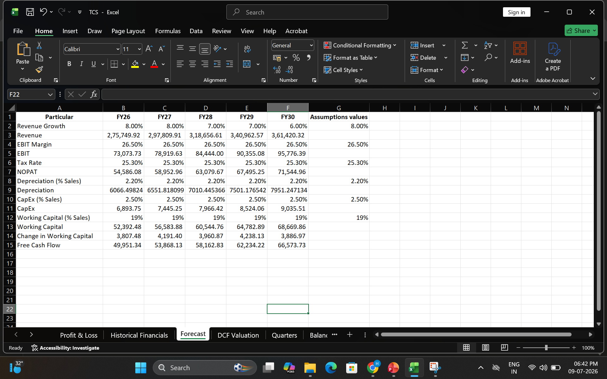
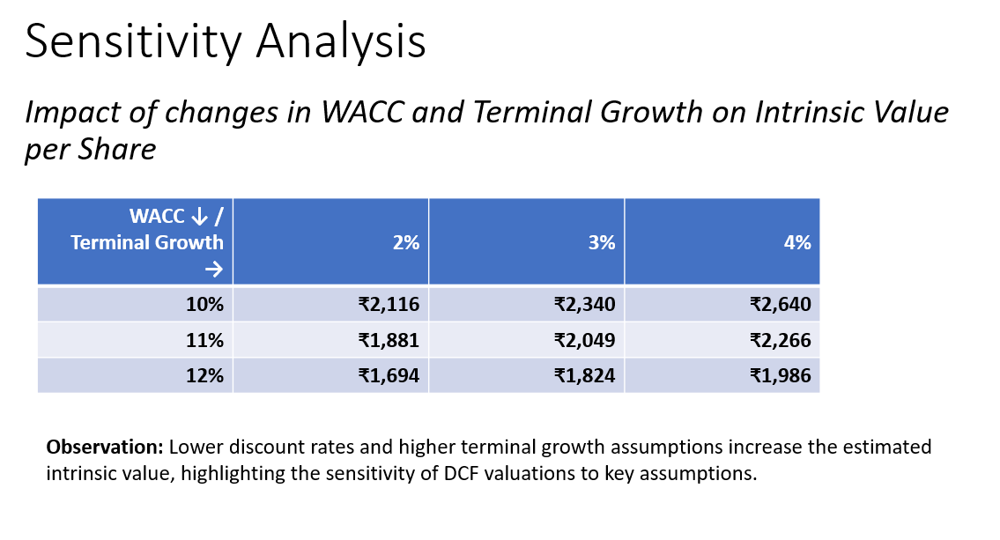

# 📈 Tata Consultancy Services (TCS) – Discounted Cash Flow (DCF) Valuation

> An equity valuation project estimating the intrinsic value of Tata Consultancy Services (TCS) using the Discounted Cash Flow (DCF) methodology.

[Dashboard](<Report/Tata Consultancy Services Ltd..ppt>)

---

# 📌 Project Overview
This project performs a complete Discounted Cash Flow (DCF) valuation of Tata Consultancy Services (TCS) to estimate its intrinsic share value based on projected future cash flows.

The valuation model includes historical financial analysis, revenue forecasting, operating profit projections, Free Cash Flow (FCF) estimation, WACC calculation, terminal value estimation, enterprise valuation, equity valuation, and sensitivity analysis.

---

# 🎯 Objective
- Analyze TCS financial statements
- Forecast future financial performance
- Estimate intrinsic share price using DCF
- Compare intrinsic value with market price
- Understand key valuation drivers

---

# 🛠 Tools Used
- Microsoft Excel
- Financial Modeling
- Discounted Cash Flow (DCF)
- Equity Research
- Corporate Finance

---

# 📊 Valuation Methodology
The valuation follows the standard DCF approach:
1. Historical Financial Analysis (FY22–FY25)
2. Revenue Forecasting (FY26–FY30)
3. EBIT Projection
4. NOPAT Calculation
5. Free Cash Flow Estimation
6. WACC Calculation
7. Terminal Value Estimation
8. Enterprise Value Calculation
9. Equity Value Calculation
10. Intrinsic Value Per Share

---

# 📈 Key Assumptions

| Assumption | Value |
|------------|--------|
| Forecast Period | FY26–FY30 |
| WACC | 11% |
| Terminal Growth Rate | 3% |

---

# 📌 Valuation Result
| Intrinsic Value per Share | **₹2,049.71** |
| Valuation Method | Discounted Cash Flow (DCF) |
| Forecast Horizon | 5 Years |

---

# 📷 Project Preview

### 📌 Financial Model

---

### 📌 Revenue Forecast

---

### 📌 Sensitivity Analysis

---

# 💡 Key Insights
- Built a complete DCF valuation model from historical financial statements.
- Forecasted revenue, EBIT, NOPAT, and Free Cash Flow over a five-year period.
- Estimated enterprise value using discounted future cash flows.
- Applied WACC and terminal growth assumptions to determine intrinsic valuation.
- Conducted sensitivity analysis to evaluate the impact of varying WACC and terminal growth rates.

---

# 📚 Skills Demonstrated
- Financial Modeling
- Equity Research
- Corporate Finance
- Company Valuation
- Discounted Cash Flow (DCF)
- Microsoft Excel
- Financial Forecasting
  
# 👨‍💻 Author
**Harsh Gaggar**
B.Tech Electronics & Telecommunication Engineering
Interested in:
- Data Analytics
- Financial Modeling
- Equity Research
- Business Intelligence

---

⭐ If you found this project interesting, consider starring the repository.
